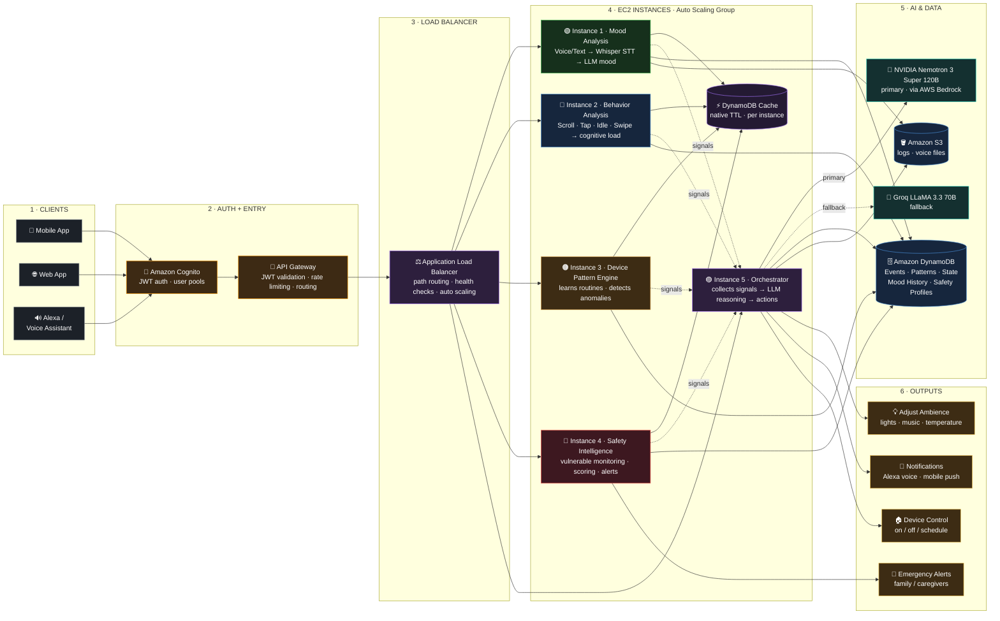
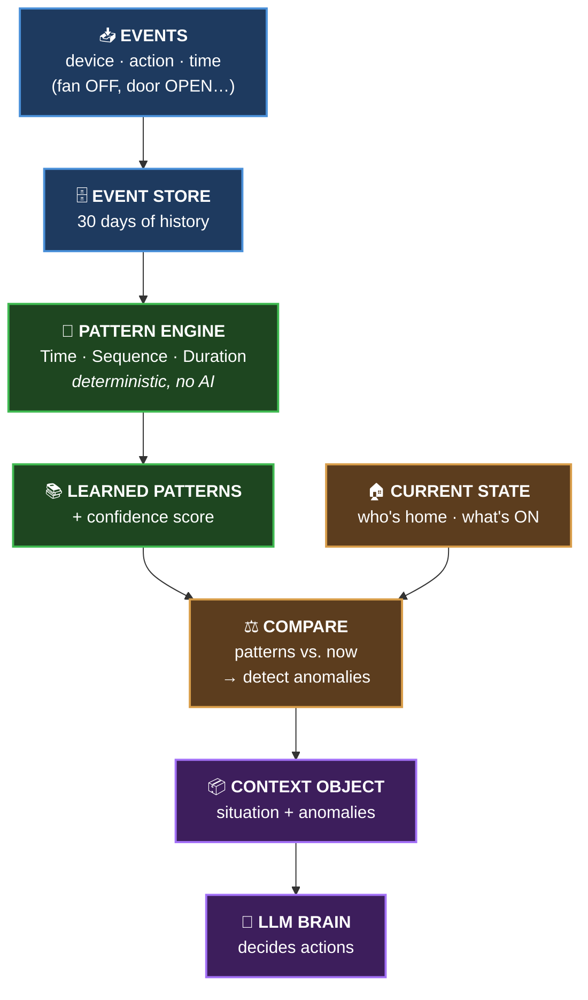
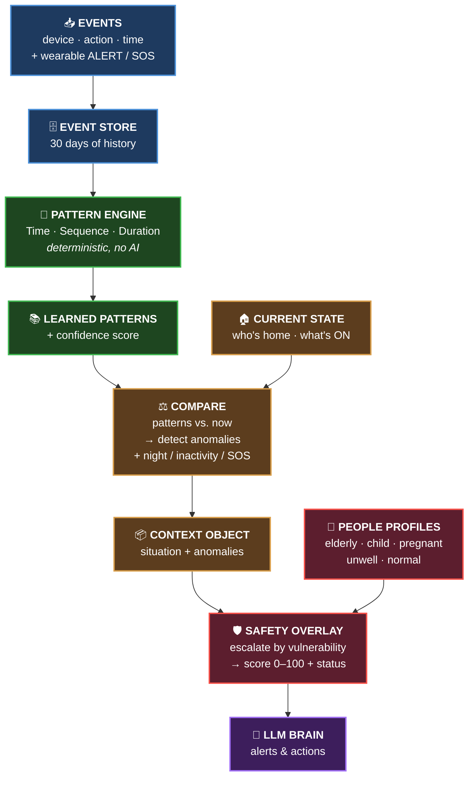

# Awaas AI — Architecture Diagrams

Block diagrams and identifier reference for the platform:

0. **Production Architecture (AWS)** — the full cloud topology
1. **Pattern Recognition System** (`backend/patterns/`)
2. **Adaptive Safety Intelligence** (`backend/safety/`)

The two intelligence engines share the same core philosophy: **patterns are
discovered deterministically (no LLM)** — the LLM only *consumes* the finished
`ContextObject`.

---

## 0 · Production Architecture (AWS)

Request flows left → right through six layers: **clients → auth → load balancer
→ compute → AI & data → outputs**. In local development the same services run
behind a FastAPI gateway (see the platform [`README.md`](../README.md)).



**Legend** — `──▶` synchronous flow · `╌╌▶` external / fallback call · `⚡` DynamoDB cache (native TTL).

### Cross-cutting shared services

These observe and support every layer:

| Service | Role |
|---------|------|
| 📊 **Amazon CloudWatch** | metrics, logs & alarms across all instances |
| 🔑 **AWS Secrets Manager** | API keys (Groq), DB creds, Bedrock access |
| 📣 **Amazon SNS / SES** | emergency alert delivery (SMS / email / push) |
| 🪣 **Amazon S3** | shared logs & archived voice files |

### AWS → local mapping

| AWS layer | Service | Maps to (local) |
|-----------|---------|-----------------|
| Clients | Mobile · Web · Alexa | React dashboard `:5173` |
| Auth + Entry | Cognito + API Gateway | FastAPI gateway `:8000` |
| Load Balancer | Application Load Balancer | gateway path-routing |
| Compute (ASG) | 5 EC2 instances | the 6 FastAPI services (`:8001`–`:8006`) |
| AI & Data | Bedrock → Groq · DynamoDB · S3 | Bedrock/Groq · DynamoDB Local `:8100` |
| Outputs | Ambience · Notifications · Device control · Emergency alerts | device + narration responses |

---

## 1 · Pattern Recognition System

### Block diagram



### The flow in one line

**Events → learn Patterns → compare with Current State → produce Context → AI acts**

| Block | What it does |
|-------|-------------|
| 📥 **Events** | Raw device actions stream in |
| 🧠 **Pattern Engine** | Learns routines (time / sequence / duration), keeps only confident ones |
| ⚖️ **Compare** | Checks learned patterns against what's happening right now |
| 📦 **Context** | Bundles the situation + any anomalies for the AI |

### Identifiers & parameters

| Stage | Code | Key parameters |
|-------|------|----------------|
| **Events** | `backend/patterns/logic/event_service.py` | `household_id`, `device_id`, `device_type`, `action`, `triggered_by`, `timestamp` |
| **Patterns** | `backend/patterns/pattern_engine/` | `time_bucket_minutes=30`, `min_pattern_occurrences=3`, `min_confidence=0.6`, `analysis_window_days=30` |
| **Confidence** | `backend/patterns/pattern_engine/confidence.py` | `confidence = support × consistency` |
| **State** | `backend/patterns/models/state.py` | `people_home`, `active_devices`, `device_on_since` |
| **Anomaly** | `backend/patterns/context_builder/anomaly.py` | `departure_grace_minutes=60`, `duration_anomaly_factor=2.0`, `max_continuous_active_minutes=720` |
| **Context** | `backend/patterns/context_builder/builder.py` | `ContextObject` → Orchestrator → LLM |

### Pattern types

| Pattern | Example | Key fields |
|---------|---------|-----------|
| **TimePattern** | "living_room_light turns ON around 19:00" | `device`, `action`, `usual_time`, `window_minutes` |
| **SequencePattern** | "door OPEN → fan OFF → light OFF" (departure) | `steps`, `usual_time` |
| **DurationPattern** | "water_motor runs ~15 min, starting ~09:00" | `usual_duration_minutes`, `stddev_minutes`, `usual_start_time` |

---

## 2 · Adaptive Safety Intelligence

The whole left side is the **same pattern pipeline**. Safety adds **one new idea**:
*who is home and how vulnerable are they*.

### Block diagram



### The flow in one line

**Events → Patterns → Compare → Context → Safety Overlay (vulnerability) → AI acts**

| Block | What it does |
|-------|-------------|
| 👥 **People Profiles** | Each member tagged: `elderly`, `child`, `pregnant`, `unwell`, or `normal` |
| 🛡️ **Safety Overlay** | Re-reads every anomaly through a vulnerability lens — *the same open door is "low" for a fit adult but "critical" for an elderly person alone* |
| **Score + Status** | Starts at 100, deducts per anomaly → **Safe / Inactive / Needs-Attention / Emergency** |

### Extra safety detectors feeding the Compare step

| Detector | Fires when |
|----------|-----------|
| 🌙 **Unsafe at night** | Door/window open during 22:00–06:00 |
| 😴 **Global inactivity** | No activity for 4 h (warn) / 8 h (emergency) while vulnerable person home alone |
| ❤️ **Health alert / SOS** | Wearable vital out of range, or panic button pressed → instant Emergency |

### Identifiers & parameters

| Stage | Code | Key identifiers / parameters |
|-------|------|------------------------------|
| **Events** | `backend/safety/logic/event_service.py` | `household_id`, `device_id`, `device_type`, `action` (adds `ALERT`, `SOS`), `triggered_by`, `timestamp`, `metadata` |
| **Patterns** | `backend/safety/pattern_engine/` | `time_bucket_minutes=30`, `min_pattern_occurrences=3`, `min_confidence=0.6`, `analysis_window_days=30` |
| **State** | `backend/safety/models/state.py` | `people_home`, `active_devices`, `device_on_since` |
| **Anomaly** | `backend/safety/context_builder/anomaly.py` | `departure_grace_minutes=60`, `duration_anomaly_factor=2.0`, `max_continuous_active_minutes=720` |
| **Safety detectors** | `backend/safety/context_builder/anomaly.py` | `global_inactivity_warn_minutes=240`, `global_inactivity_emergency_minutes=480`, `night_start_hour=22`, `night_end_hour=6` |
| **Profiles** | `backend/safety/models/safety.py` | `person_id`, `display_name`, `vulnerability`, `emergency_contacts`, `wearable_id`, `relation` |
| **Safety overlay** | `backend/safety/context_builder/safety_overlay.py` | vulnerability weights → escalate severity → `safety_score` (0–100) + `status` |
| **Output** | `backend/safety/models/context.py` | `ContextObject` + `SafetyAssessment` → Orchestrator → LLM |

### Vulnerability weights (the new escalation logic)

| Identifier | Value | Meaning |
|------------|-------|---------|
| `vuln_weight_normal` | `1.0` | Capable adult — no escalation |
| `vuln_weight_child` | `1.7` | Minor at home |
| `vuln_weight_pregnant` | `1.8` | Expecting mother |
| `vuln_weight_unwell` | `1.8` | Recovering / fragile |
| `vuln_weight_elderly` | `2.0` | Senior living independently |
| `supervised_mitigation` | `0.6` | A capable adult present *reduces* risk |

### Anomaly types & base risk rank

| `AnomalyType` | Base rank | Severity scale |
|---------------|-----------|----------------|
| `MISSED_ROUTINE` | 1 | low |
| `DEVICE_LEFT_ON`, `DURATION_EXCEEDED`, `DEVICE_ACTIVE_TOO_LONG`, `MISSED_MEDICINE`, `MISSED_ARRIVAL` | 2 | medium |
| `UNEXPECTED_ACTIVITY`, `INACTIVITY`, `UNSAFE_AT_NIGHT` | 3 | high |
| `GLOBAL_INACTIVITY`, `HEALTH_ALERT`, `SOS` | 4 | critical |

> Escalated rank = `round(base_rank × vulnerability_factor)`, clamped to 0–4 →
> mapped to `["low", "low", "medium", "high", "critical"]`.

### Scoring & status thresholds

| Identifier | Value | Effect |
|------------|-------|--------|
| `_SEVERITY_PENALTY` | low=4, medium=12, high=28, critical=55 | Points deducted from 100 |
| `SafetyStatus.EMERGENCY` | score < 25, or SOS / Health / Global-inactivity | Highest urgency |
| `SafetyStatus.NEEDS_ATTENTION` | score < 60, or any high/critical anomaly | Concern |
| `SafetyStatus.INACTIVE` | only inactivity-type anomalies | Quiet home |
| `SafetyStatus.SAFE` | otherwise | All normal |

### Context types (headline situation)

| `ContextType` | Triggered by |
|---------------|--------------|
| `EMERGENCY` | SOS · Health alert · Global inactivity |
| `SAFETY_ALERT` | Unsafe at night (open door 22:00–06:00) |
| `SECURITY_ALERT` | Unexpected activity (off-schedule entry) |
| `CARE_ALERT` | Inactivity · Missed medicine · Missed arrival |
| `DEPARTURE_ANOMALY` / `DURATION_ANOMALY` | Device left on / running too long |
| `ROUTINE_SUGGESTION` / `NORMAL` | Missed routine / all clear |

---

## Key design principle

Both engines keep pattern discovery **deterministic and explainable**:

```
Events → Pattern Extraction → Household Knowledge → Context Builder → LLM
```

The LLM (Groq / AWS Bedrock) never *discovers* patterns — it only phrases the
already-computed `ContextObject` into natural-language actions and alerts.