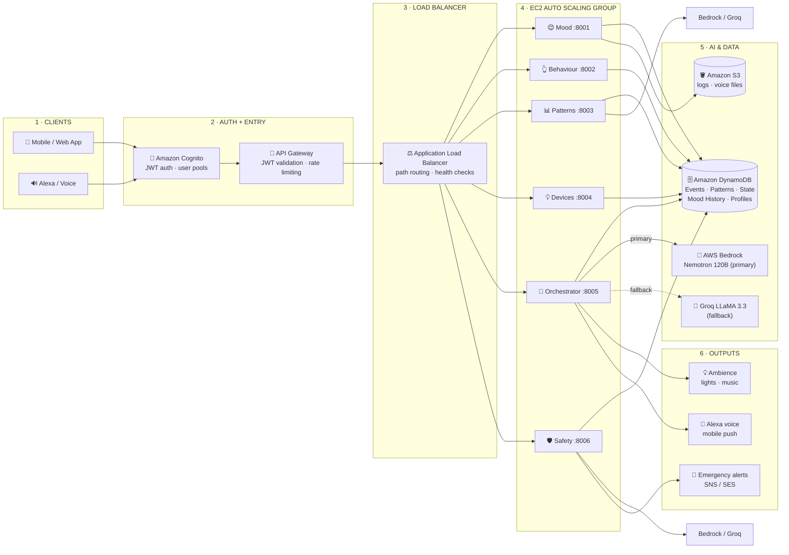

# Awaas AI — AWS Deployment Guide

> **Who this is for:** Anyone who wants to take Awaas AI from `docker-compose up`
> on a laptop to a live URL on AWS. It assumes no prior AWS knowledge — every
> service is explained from first principles, mapped to the exact files and ports
> in this codebase.
>
> For the high-level architecture diagrams and block-diagram walkthroughs see
> [`ARCHITECTURE_DIAGRAMS.md`](ARCHITECTURE_DIAGRAMS.md). This document is the
> *operational* complement: what to provision, in what order, with what settings.

---

## Table of Contents

1. [The Mental Model](#1-the-mental-model)
2. [Production Architecture Overview](#2-production-architecture-overview)
3. [Layer-by-Layer Service Reference](#3-layer-by-layer-service-reference)
   - [Layer 1 — Clients](#layer-1--clients)
   - [Layer 2 — Auth + Entry (Cognito + API Gateway)](#layer-2--auth--entry)
   - [Layer 3 — Application Load Balancer](#layer-3--application-load-balancer)
   - [Layer 4 — EC2 Auto Scaling Group (your code)](#layer-4--ec2-auto-scaling-group)
   - [Layer 5 — AI & Data (Bedrock, DynamoDB, S3)](#layer-5--ai--data)
   - [Layer 6 — Outputs (SNS/SES)](#layer-6--outputs)
   - [Cross-cutting Services (CloudWatch, Secrets Manager)](#cross-cutting-services)
4. [DynamoDB Tables Reference](#4-dynamodb-tables-reference)
5. [Local → Production Mapping](#5-local--production-mapping)
6. [What Changes in Code, What Doesn't](#6-what-changes-in-code-what-doesnt)
7. [IAM Permissions Required](#7-iam-permissions-required)
8. [Environment Variables Reference](#8-environment-variables-reference)
9. [Step-by-Step Deployment Walkthrough](#9-step-by-step-deployment-walkthrough)
   - [Phase 0 — Prerequisites](#phase-0--prerequisites)
   - [Phase 1 — Data Layer (DynamoDB)](#phase-1--data-layer-dynamodb)
   - [Phase 2 — AI Layer (Bedrock)](#phase-2--ai-layer-bedrock)
   - [Phase 3 — Secrets](#phase-3--secrets)
   - [Phase 4 — Single-Instance Quick Deploy (demo)](#phase-4--single-instance-quick-deploy-demo)
   - [Phase 5 — Full Production (ALB + ASG)](#phase-5--full-production-alb--asg)
   - [Phase 6 — Auth (Cognito + API Gateway)](#phase-6--auth-cognito--api-gateway)
   - [Phase 7 — Monitoring (CloudWatch)](#phase-7--monitoring-cloudwatch)
10. [Cost Estimate](#10-cost-estimate)
11. [Disaster Recovery & Backups](#11-disaster-recovery--backups)
12. [Security Checklist](#12-security-checklist)

---

## 1. The Mental Model

Before touching AWS, it helps to think in terms you already know.

| Familiar concept | AWS equivalent in Awaas AI |
|---|---|
| Your laptop running `docker-compose up` | EC2 instance(s) running Docker |
| `localhost:8100` DynamoDB Local | Amazon DynamoDB (real, in the cloud) |
| `backend/.env` file with API keys | AWS Secrets Manager |
| Your FastAPI gateway on `:8000` doing path routing | Application Load Balancer |
| "Who is allowed to log in" | Amazon Cognito |
| Rate limiting + token checks at the front door | Amazon API Gateway |
| `print()` output in your terminal | Amazon CloudWatch Logs |
| Calling Bedrock from your laptop | Calling Bedrock from EC2 (same code, different network) |

The key insight: **your Python and React code does not change at all** between local and production. Only environment variables and infrastructure change. The code is already written to be environment-agnostic — `boto3` connects to real DynamoDB when `DYNAMODB_ENDPOINT_URL` is absent, and the narrator calls Bedrock when `LLM_PROVIDER=bedrock`.

---

## 2. Production Architecture Overview

Request flows left → right through six layers:

```
Clients → Auth + Entry → Load Balancer → EC2 Compute → AI & Data → Outputs
```



**Cross-cutting** (every layer): CloudWatch (logs/metrics/alarms) · Secrets Manager (API keys) · IAM (permissions).

---

## 3. Layer-by-Layer Service Reference

### Layer 1 — Clients

Three types of client hit the system:

| Client | Local URL | Production URL |
|---|---|---|
| React Web App | `http://localhost:5173` | `https://app.awaasai.com` (your domain) |
| Alexa Skill | n/a | AWS Alexa Skill Kit endpoint → API Gateway |
| Mobile App | n/a | Same API Gateway endpoint |

The clients themselves don't live in AWS (they run on the user's device or speaker). But every HTTP request they make goes through the next layer before reaching your code.

---

### Layer 2 — Auth + Entry

#### Amazon Cognito — "the identity system"

Cognito manages user accounts, login, and session tokens for your application. When a family member signs up for Awaas AI, their account is stored in a Cognito **User Pool**.

**What it does:**
- Handles signup / login / forgot-password flows (your frontend already has these pages: `Login.jsx`, `Signup.jsx`, `ForgotPassword.jsx`)
- Issues a **JWT (JSON Web Token)** after successful login — a cryptographically signed string that proves who the user is and which household they belong to
- Every API request must carry this token in the `Authorization` header
- Tokens expire (default 1 hour); Cognito handles refresh tokens automatically

**Cognito concepts you need to know:**

| Term | Meaning |
|---|---|
| **User Pool** | The database of accounts (email + password, or social login) |
| **App Client** | A "slot" that allows your web/mobile app to authenticate against the pool |
| **Identity Pool** | Converts a Cognito user into temporary AWS credentials (needed if the frontend calls DynamoDB or S3 directly — Awaas AI doesn't do this) |
| **JWT / ID Token** | The signed proof-of-identity sent with every API request |

**Relevant codebase files:**
- `frontend/src/context/AuthContext.jsx` — React context managing auth state
- `frontend/src/components/ProtectedRoute.jsx` — redirects unauthenticated users to `/login`
- `frontend/src/pages/Login.jsx`, `Signup.jsx`, `ForgotPassword.jsx` — auth UIs

#### Amazon API Gateway — "the smart front door"

API Gateway sits in front of your Load Balancer and does three things before a request reaches any of your code:

1. **JWT validation** — checks the token from Cognito is valid and not expired (no code needed; configured in the AWS console)
2. **Rate limiting** — blocks clients sending too many requests per second (protects your EC2 instances from abuse)
3. **Path routing** — routes `/mood/*` → Mood service, `/patterns/*` → Patterns service, etc., mirroring what `gateway/main.py` does locally

In the local dev environment, `gateway/main.py` on port `:8000` is the stand-in for both API Gateway (routing) and Cognito (auth is skipped locally).

---

### Layer 3 — Application Load Balancer

The **ALB (Application Load Balancer)** distributes incoming HTTP requests across your EC2 instances. It is placed between API Gateway and your compute layer.

**What it does:**
- **Path-based routing:** a rule like `path starts with /patterns` → forward to the "Patterns" target group (the set of EC2 instances running `patterns.app.main:app`)
- **Health checks:** periodically calls `GET /health` on each instance. If an instance fails (e.g. crashes), the ALB stops sending it traffic within seconds
- **Auto scaling trigger:** the ALB exposes metrics (requests/sec, latency) that the Auto Scaling Group reads to decide when to add/remove EC2 instances

**ALB listener rules for Awaas AI** (in order of priority):

| Path prefix | Routes to |
|---|---|
| `/mood/*` | Mood service target group (`:8001`) |
| `/behaviour/*` | Behaviour service target group (`:8002`) |
| `/patterns/*`, `/events/*`, `/state/*`, `/context/*` | Patterns service target group (`:8003`) |
| `/devices/*` | Devices service target group (`:8004`) |
| `/orchestrator/*` | Orchestrator target group (`:8005`) |
| `/safety/*`, `/admin/*` | Safety service target group (`:8006`) |

---

### Layer 4 — EC2 Auto Scaling Group

**EC2 (Elastic Compute Cloud)** instances are virtual machines in AWS's datacentre. You pick a size, upload your Docker image, and AWS runs it. An **Auto Scaling Group (ASG)** is a policy that says "keep between X and Y instances running, and add more when CPU goes above Z%."

**For Awaas AI, each microservice runs in its own target group:**

| Service | File | Port | Recommended instance type |
|---|---|---|---|
| 😌 Mood | `backend/services/mood/` | 8001 | `t3.medium` (needs enough RAM for Whisper STT) |
| 👆 Behaviour | `backend/services/behavior/` | 8002 | `t3.small` (lightweight scoring) |
| 📊 Patterns | `backend/patterns/` | 8003 | `t3.medium` (pattern extraction is CPU-bound) |
| 💡 Devices | `backend/services/devices/` | 8004 | `t3.small` |
| 🧠 Orchestrator | `backend/services/orchestrator/` | 8005 | `t3.medium` (orchestrates all others) |
| 🛡️ Safety | `backend/safety/` | 8006 | `t3.medium` (twin of Patterns) |

**How your Docker setup translates:**

Your `docker-compose.yml` already defines all services with their ports and dependencies. For EC2 deployment, each service becomes a separate Docker container image pushed to **Amazon ECR (Elastic Container Registry)** — AWS's private Docker Hub. On startup, each EC2 instance pulls the image for its designated service and runs it.

```
Your docker-compose.yml  →  separate ECR image per service
docker-compose up         →  EC2 instance pulls image + runs it
localhost:8003            →  EC2 private IP:8003 (behind ALB)
```

**Auto Scaling policy recommendation for demo:**

| Setting | Value | Reason |
|---|---|---|
| Minimum instances | 2 per service | If one crashes, traffic still flows |
| Maximum instances | 5 per service | Prevents runaway bills |
| Scale-out trigger | CPU > 70% for 3 minutes | Add instance when busy |
| Scale-in trigger | CPU < 30% for 10 minutes | Remove instance when idle |

---

### Layer 5 — AI & Data

This is the most important layer because **parts of it are already wired into the codebase and work today**.

#### Amazon DynamoDB — "the database"

DynamoDB is AWS's managed NoSQL database. You don't manage servers, backups, or scaling — AWS handles all of that. Data is stored as items (like JSON documents) in tables, accessed by a primary key.

**Already used in this codebase.** Locally you run `amazon/dynamodb-local` in Docker as a perfect drop-in replacement. In production, you point at the real DynamoDB by simply removing (or leaving blank) `DYNAMODB_ENDPOINT_URL` from `backend/.env`. The `boto3` client code in `patterns/dynamodb/resource.py` and `safety/dynamodb/resource.py` is **identical** for both local and production.

All tables use **PAY_PER_REQUEST** billing — you pay per read/write operation, not for reserved capacity. For a demo household the monthly cost is effectively zero.

See [Section 4](#4-dynamodb-tables-reference) for the full table reference.

#### AWS Bedrock — "the LLM narrator"

Bedrock is AWS's managed LLM service. Instead of running a model yourself on expensive GPU hardware, you call an API and AWS runs the model in their infrastructure. You pay per token (roughly per word in/out).

**Already wired in.** Your narrator (`backend/safety/logic/narrator.py`, `backend/patterns/logic/narrator.py`, `backend/services/orchestrator/`) calls Bedrock when `LLM_PROVIDER=bedrock`. The fallback chain is:

```
AWS Bedrock (Nemotron 120B)
    → Groq (LLaMA 3.3 70B)   [if Bedrock times out or errors]
        → Deterministic template  [if both LLMs are unreachable]
```

The notification **always** appears — the system never silently fails.

**Model in use:** `nvidia.nemotron-super-3-120b` — a 120 billion parameter model, accessed via Bedrock's Converse API. You need to request access to this model in the Bedrock console before using it (approval is near-instant).

#### Amazon S3 — "the file storage"

S3 (Simple Storage Service) stores objects (files) permanently with a URL. In Awaas AI, S3 is used for:

- **Voice audio files** — when the Mood service receives audio from an Alexa skill, the `.wav` is saved to S3 before Whisper transcribes it
- **Application logs** — CloudWatch log groups can be exported to S3 for long-term retention (default CloudWatch keeps logs 30 days)

S3 is not yet used in the local development flow — it becomes relevant when connecting to a real Alexa skill or when you need audit logs beyond CloudWatch's retention window.

---

### Layer 6 — Outputs

#### Amazon SNS / SES — "emergency alerts"

**SNS (Simple Notification Service)** sends push notifications, SMS messages, and can trigger other AWS services. **SES (Simple Email Service)** sends email.

In Awaas AI, the Safety service detects emergencies (SOS, global inactivity, health alert) and stores emergency contacts in `PersonProfile.emergency_contacts`. In a full production system, those contacts would be notified via:

- **SNS → SMS** → family member's phone number
- **SNS → Push notification** → family member's mobile app
- **SES → Email** → family member's email

The data model already supports this — `emergency_contacts` holds free-form identifiers (like `"son_bangalore"`, `"daughter_pune"`). The integration point is in `backend/safety/context_builder/safety_overlay.py` after the `assess()` function determines `SafetyStatus.EMERGENCY`.

---

### Cross-Cutting Services

These run silently in the background, supporting every layer.

#### Amazon CloudWatch — "the monitoring system"

Every service running on EC2 automatically sends logs to CloudWatch. You can:

- **Search logs** — find all 500 errors in the last hour across all Patterns instances
- **Create dashboards** — graph requests/sec, Bedrock latency, DynamoDB read units
- **Set alarms** — "notify me if the error rate on `/context/evaluate` exceeds 5% for 5 minutes"
- **View metrics** — CPU/memory on each EC2 instance

In local development, logs go to your terminal. In production, every `print()`, `logger.info()`, and exception traceback goes to CloudWatch automatically when you configure the Docker log driver.

**Key metrics to watch for Awaas AI:**

| Metric | What it tells you |
|---|---|
| `5xx errors on /context/*/evaluate` | Safety or Patterns engine crashing |
| `Bedrock InvokeModel latency` | LLM response time (narration speed) |
| `DynamoDB ConsumedReadCapacityUnits` | How often events/patterns are read |
| `ALB TargetResponseTime` | End-to-end API latency |
| `AutoScaling GroupDesiredCapacity` | How many instances are running |

#### AWS Secrets Manager — "the key safe"

In local dev, API keys live in `backend/.env`. In production, storing secrets in files on EC2 instances is a security risk — if someone gets into the instance, they get the keys.

Secrets Manager stores keys encrypted at rest, rotates them on a schedule if needed, and your code fetches them at startup via an API call. The keys never appear in files or environment variables on disk.

**Secrets to store for Awaas AI:**

| Secret name | Value |
|---|---|
| `awaasai/groq-api-key` | Your Groq API key |
| `awaasai/bedrock-model-id` | `nvidia.nemotron-super-3-120b` |
| `awaasai/dynamodb-region` | `us-east-1` (or your region) |

Your `backend/services/*/config.py` files use Pydantic `BaseSettings` which reads from environment variables. On EC2, you inject these from Secrets Manager into the container's environment at launch time via an IAM role (no code changes needed).

#### AWS IAM — "the permissions system"

IAM (Identity and Access Management) controls which AWS services can talk to which other AWS services.

Your EC2 instances need an **IAM Role** (an identity for the machine, not a person) with permissions to:
- Read/write DynamoDB tables (`dynamodb:PutItem`, `dynamodb:GetItem`, `dynamodb:Query`, `dynamodb:Scan`)
- Call Bedrock (`bedrock:InvokeModel`)
- Read from Secrets Manager (`secretsmanager:GetSecretValue`)
- Write logs to CloudWatch (`logs:CreateLogGroup`, `logs:PutLogEvents`)
- Read/write S3 for voice files and logs (`s3:PutObject`, `s3:GetObject`)

The EC2 instances assume this role automatically at launch. Your `boto3` code picks up the credentials from the instance metadata — no keys stored anywhere.

---

## 4. DynamoDB Tables Reference

### Patterns Service Tables

| Table name | Partition key | Sort key | What's inside |
|---|---|---|---|
| `SmartHome_Events` | `household_id` | `{ISO-timestamp}#{event_id}` | Every device event: `device_id`, `device_type`, `room`, `action`, `triggered_by`, `timestamp`, `metadata` |
| `SmartHome_HouseholdState` | `household_id` | *(none)* | Live snapshot: `people_home`, `active_devices`, `device_on_since`, `updated_at` |
| `SmartHome_Patterns` | `household_id` | `pattern_id` | Learned routines: `pattern_type`, `confidence`, `occurrences`, `last_updated` + type-specific fields |

### Safety Service Tables

| Table name | Partition key | Sort key | What's inside |
|---|---|---|---|
| `Safety_Events` | `household_id` | `{ISO-timestamp}#{event_id}` | Same shape as SmartHome_Events, independent data |
| `Safety_HouseholdState` | `household_id` | *(none)* | Same shape as SmartHome_HouseholdState |
| `Safety_Patterns` | `household_id` | `pattern_id` | Same shape as SmartHome_Patterns |
| `Safety_Profiles` | `household_id` | `person_id` | `display_name`, `vulnerability`, `emergency_contacts`, `wearable_id`, `relation` |

### Mood / Orchestrator Tables

| Table name | Partition key | Sort key | What's inside |
|---|---|---|---|
| `SmartHome_MoodHistory` | `household_id` | `{ISO-timestamp}#{entry_id}` | Detected mood, cognitive load, confidence, Alexa response, actions taken |

### All tables use

- **Billing mode:** `PAY_PER_REQUEST` (no capacity planning needed)
- **Region:** same as your EC2 instances (reduces latency and avoids cross-region data charges)
- **Encryption:** AWS-managed keys by default (enabled at no extra cost)
- **Point-in-time recovery:** enable this for production (35-day restore window, small cost)

---

## 5. Local → Production Mapping

| Component | Local | Production |
|---|---|---|
| **DynamoDB** | `docker run -p 8100:8000 amazon/dynamodb-local` + `DYNAMODB_ENDPOINT_URL=http://localhost:8100` | Real DynamoDB — remove `DYNAMODB_ENDPOINT_URL` entirely |
| **LLM narrator** | `LLM_PROVIDER=groq` with `GROQ_API_KEY` | `LLM_PROVIDER=bedrock` + IAM role (no key file needed) |
| **Auth** | No authentication, open ports | Cognito JWT middleware on every request |
| **API routing** | `gateway/main.py` on `:8000` | API Gateway + ALB listener rules |
| **Running services** | `docker-compose up` on laptop | EC2 instances + Auto Scaling Group |
| **Secrets** | `backend/.env` file | AWS Secrets Manager → injected as env vars |
| **Logs** | Terminal output | CloudWatch Logs |
| **Emergency alerts** | Not wired | SNS/SES |
| **React app** | `npm run dev` → `:5173` | S3 static hosting + CloudFront CDN |
| **HTTPS / TLS** | None needed locally | ACM (AWS Certificate Manager) — free TLS certificate |

---

## 6. What Changes in Code, What Doesn't

### Code that does NOT change

- All FastAPI route handlers (`routes/`)
- All Pydantic models (`models/`)
- All business logic (`logic/`, `context_builder/`, `pattern_engine/`)
- The `boto3` DynamoDB client code (`dynamodb/resource.py`) — it auto-connects to real DynamoDB when `DYNAMODB_ENDPOINT_URL` is absent
- The Bedrock client in `narrator.py` — it uses the instance's IAM role credentials automatically
- The React frontend — except the API base URLs in `.env`

### Only environment variables change

```bash
# LOCAL backend/.env
LLM_PROVIDER=groq
GROQ_API_KEY=gsk_xxxxx
DYNAMODB_ENDPOINT_URL=http://localhost:8100

# PRODUCTION (injected from Secrets Manager, no .env file)
LLM_PROVIDER=bedrock
AWS_REGION=us-east-1
BEDROCK_MODEL_ID=nvidia.nemotron-super-3-120b
# DYNAMODB_ENDPOINT_URL is absent → boto3 uses real DynamoDB
```

```bash
# LOCAL frontend/.env
VITE_API_BASE_URL=http://localhost:8000
VITE_PATTERNS_API_BASE=http://localhost:8003
VITE_SAFETY_API_BASE=http://localhost:8006

# PRODUCTION frontend/.env (baked into the build)
VITE_API_BASE_URL=https://api.awaasai.com
VITE_PATTERNS_API_BASE=https://api.awaasai.com/patterns
VITE_SAFETY_API_BASE=https://api.awaasai.com/safety
```

---

## 7. IAM Permissions Required

Create an **IAM Role** named `awaasai-ec2-role` and attach these policies:

### Inline policy: `awaasai-application`

```json
{
  "Version": "2012-10-17",
  "Statement": [
    {
      "Sid": "DynamoDB",
      "Effect": "Allow",
      "Action": [
        "dynamodb:PutItem",
        "dynamodb:GetItem",
        "dynamodb:UpdateItem",
        "dynamodb:DeleteItem",
        "dynamodb:Query",
        "dynamodb:Scan",
        "dynamodb:BatchWriteItem",
        "dynamodb:DescribeTable",
        "dynamodb:CreateTable"
      ],
      "Resource": [
        "arn:aws:dynamodb:us-east-1:YOUR_ACCOUNT_ID:table/SmartHome_*",
        "arn:aws:dynamodb:us-east-1:YOUR_ACCOUNT_ID:table/Safety_*"
      ]
    },
    {
      "Sid": "Bedrock",
      "Effect": "Allow",
      "Action": ["bedrock:InvokeModel", "bedrock:InvokeModelWithResponseStream"],
      "Resource": "arn:aws:bedrock:us-east-1::foundation-model/nvidia.nemotron-super-3-120b"
    },
    {
      "Sid": "SecretsManager",
      "Effect": "Allow",
      "Action": ["secretsmanager:GetSecretValue"],
      "Resource": "arn:aws:secretsmanager:us-east-1:YOUR_ACCOUNT_ID:secret:awaasai/*"
    },
    {
      "Sid": "CloudWatchLogs",
      "Effect": "Allow",
      "Action": [
        "logs:CreateLogGroup",
        "logs:CreateLogStream",
        "logs:PutLogEvents",
        "logs:DescribeLogStreams"
      ],
      "Resource": "arn:aws:logs:us-east-1:YOUR_ACCOUNT_ID:log-group:/awaasai/*"
    },
    {
      "Sid": "S3",
      "Effect": "Allow",
      "Action": ["s3:PutObject", "s3:GetObject", "s3:ListBucket"],
      "Resource": [
        "arn:aws:s3:::awaasai-logs",
        "arn:aws:s3:::awaasai-logs/*",
        "arn:aws:s3:::awaasai-voice-files/*"
      ]
    },
    {
      "Sid": "SNS",
      "Effect": "Allow",
      "Action": ["sns:Publish"],
      "Resource": "arn:aws:sns:us-east-1:YOUR_ACCOUNT_ID:awaasai-emergency-alerts"
    }
  ]
}
```

Attach this role to every EC2 instance at launch. Your `boto3` code automatically uses it — no access keys stored anywhere.

---

## 8. Environment Variables Reference

### `backend/.env` (production values)

```bash
# ── LLM ────────────────────────────────────────────────────────────────────
LLM_PROVIDER=bedrock                          # "bedrock" or "groq"
BEDROCK_MODEL_ID=nvidia.nemotron-super-3-120b
AWS_REGION=us-east-1

# GROQ is the fallback — still configure it even when Bedrock is primary
GROQ_API_KEY=gsk_xxxxx                        # fetch from Secrets Manager
GROQ_LLM_MODEL=llama-3.3-70b-versatile
GROQ_MODEL=llama-3.3-70b-versatile

# ── DynamoDB ────────────────────────────────────────────────────────────────
# Leave DYNAMODB_ENDPOINT_URL unset → boto3 connects to real DynamoDB
# DYNAMODB_ENDPOINT_URL=                      # commented out in production

# ── Pattern engine knobs ────────────────────────────────────────────────────
ANALYSIS_WINDOW_DAYS=30
MIN_CONFIDENCE=0.6
MIN_PATTERN_OCCURRENCES=3
DURATION_ANOMALY_FACTOR=2.0
DEPARTURE_GRACE_MINUTES=60
MAX_CONTINUOUS_ACTIVE_MINUTES=720

# ── Safety engine knobs ─────────────────────────────────────────────────────
GLOBAL_INACTIVITY_WARN_MINUTES=240
GLOBAL_INACTIVITY_EMERGENCY_MINUTES=480
NIGHT_START_HOUR=22
NIGHT_END_HOUR=6
VULN_WEIGHT_ELDERLY=2.0
VULN_WEIGHT_CHILD=1.7
VULN_WEIGHT_PREGNANT=1.8
VULN_WEIGHT_UNWELL=1.8
VULN_WEIGHT_NORMAL=1.0
SUPERVISED_MITIGATION=0.6

# ── Narrator timeout ────────────────────────────────────────────────────────
NARRATOR_TIMEOUT_SECONDS=8
```

### `frontend/.env` (production build)

```bash
VITE_API_BASE_URL=https://api.awaasai.com
VITE_WS_URL=wss://api.awaasai.com/alexa/stream
VITE_PATTERNS_API_BASE=https://api.awaasai.com
VITE_SAFETY_API_BASE=https://api.awaasai.com
```

---

## 9. Step-by-Step Deployment Walkthrough

### Phase 0 — Prerequisites

1. **Create an AWS account** at [aws.amazon.com](https://aws.amazon.com) if you don't have one.

2. **Install the AWS CLI** — the command-line tool for managing AWS from your terminal:
   ```bash
   # macOS
   brew install awscli

   # Windows
   winget install Amazon.AWSCLI

   # verify
   aws --version
   ```

3. **Create an IAM user for yourself** (not the root account — root is dangerous to use directly):
   - AWS Console → IAM → Users → Create User
   - Attach policy: `AdministratorAccess` (for initial setup; tighten later)
   - Download the Access Key ID and Secret Access Key

4. **Configure the CLI:**
   ```bash
   aws configure
   # AWS Access Key ID: AKIA...
   # AWS Secret Access Key: xxxxx
   # Default region: us-east-1
   # Default output format: json
   ```

5. **Install Docker** (you likely already have it) and make sure Docker is running.

---

### Phase 1 — Data Layer (DynamoDB)

This is the easiest step because your code does it automatically.

**Option A — Auto-create on first startup (recommended)**

Both `patterns/app/main.py` and `safety/app/main.py` call `create_tables()` on startup. When `DYNAMODB_ENDPOINT_URL` is absent, they create the tables in real DynamoDB. Run the app once with real AWS credentials and the tables appear.

**Option B — Create tables manually via your scripts**

```bash
cd backend

# Set real AWS credentials (not the local DynamoDB URL)
unset DYNAMODB_ENDPOINT_URL
export AWS_REGION=us-east-1

# Create tables
python patterns/dynamodb/create_tables.py
python safety/dynamodb/create_tables.py   # if exists, else tables auto-create

# Verify in the console: AWS Console → DynamoDB → Tables
# You should see: SmartHome_Events, SmartHome_HouseholdState, SmartHome_Patterns,
#                 Safety_Events, Safety_HouseholdState, Safety_Patterns, Safety_Profiles
```

**Enable Point-in-Time Recovery** (strongly recommended for production):
```bash
aws dynamodb update-continuous-backups \
  --table-name SmartHome_Events \
  --point-in-time-recovery-specification PointInTimeRecoveryEnabled=true

# Repeat for each table
```

---

### Phase 2 — AI Layer (Bedrock)

1. **Request model access:**
   - AWS Console → Bedrock → Model access → Manage model access
   - Find "NVIDIA Nemotron Super 3 120B" and click "Request access"
   - Approval is near-instant for most models

2. **Test that Bedrock works from your machine:**
   ```bash
   python - <<'EOF'
   import boto3, json
   client = boto3.client("bedrock-runtime", region_name="us-east-1")
   response = client.converse(
       modelId="nvidia.nemotron-super-3-120b",
       messages=[{"role": "user", "content": [{"text": "Say hello."}]}]
   )
   print(response["output"]["message"]["content"][0]["text"])
   EOF
   ```

3. **Set `LLM_PROVIDER=bedrock`** in `backend/.env` and verify the narrator uses Bedrock by running the safety service locally and calling `/context/narrate`.

---

### Phase 3 — Secrets

Store your Groq API key in Secrets Manager so it never lives in a file on a server:

```bash
aws secretsmanager create-secret \
  --name "awaasai/groq-api-key" \
  --secret-string "gsk_your_actual_key_here"

aws secretsmanager create-secret \
  --name "awaasai/config" \
  --secret-string '{
    "LLM_PROVIDER": "bedrock",
    "BEDROCK_MODEL_ID": "nvidia.nemotron-super-3-120b",
    "AWS_REGION": "us-east-1",
    "GROQ_API_KEY": "gsk_your_actual_key_here",
    "GROQ_LLM_MODEL": "llama-3.3-70b-versatile"
  }'
```

On the EC2 instance, the startup script fetches these and exports them as environment variables before launching the FastAPI service.

---

### Phase 4 — Single-Instance Quick Deploy (demo)

This gets the app live on a single EC2 instance in under 30 minutes. No load balancer, no auto scaling — ideal for a hackathon demo.

**Step 1 — Launch an EC2 instance:**
- AWS Console → EC2 → Launch Instance
- AMI: **Amazon Linux 2023** (free tier eligible)
- Instance type: **t3.medium** (2 vCPU, 4GB RAM — handles all 6 services)
- Key pair: create a new one, download the `.pem` file
- Security group: allow inbound **port 22** (SSH from your IP), **port 80** (HTTP), **port 443** (HTTPS), **ports 8001–8006** (services, optional — can remove after adding ALB)
- IAM instance profile: attach the `awaasai-ec2-role` you created in Section 7
- Storage: 20 GB (enough for Docker images)

**Step 2 — SSH into the instance:**
```bash
chmod 400 your-key.pem
ssh -i your-key.pem ec2-user@YOUR_EC2_PUBLIC_IP
```

**Step 3 — Install Docker and Docker Compose:**
```bash
sudo dnf update -y
sudo dnf install -y docker git
sudo systemctl start docker
sudo systemctl enable docker
sudo usermod -aG docker ec2-user

# Install Docker Compose
sudo curl -L "https://github.com/docker/compose/releases/latest/download/docker-compose-$(uname -s)-$(uname -m)" \
  -o /usr/local/bin/docker-compose
sudo chmod +x /usr/local/bin/docker-compose

# Log out and back in so the docker group takes effect
exit
ssh -i your-key.pem ec2-user@YOUR_EC2_PUBLIC_IP
```

**Step 4 — Clone the repo and configure:**
```bash
git clone https://github.com/YOUR_ORG/AwaasAI.git
cd AwaasAI

# Create production .env
cat > backend/.env << 'EOF'
LLM_PROVIDER=bedrock
BEDROCK_MODEL_ID=nvidia.nemotron-super-3-120b
AWS_REGION=us-east-1
GROQ_API_KEY=gsk_your_key_here
GROQ_LLM_MODEL=llama-3.3-70b-versatile
GROQ_MODEL=llama-3.3-70b-versatile
NARRATOR_TIMEOUT_SECONDS=8
EOF

# Point the frontend at this server's public IP
PUBLIC_IP=$(curl -s http://169.254.169.254/latest/meta-data/public-ipv4)
cat > frontend/.env << EOF
VITE_API_BASE_URL=http://$PUBLIC_IP:8000
VITE_PATTERNS_API_BASE=http://$PUBLIC_IP:8003
VITE_SAFETY_API_BASE=http://$PUBLIC_IP:8006
EOF
```

**Step 5 — Build and run:**
```bash
docker-compose up --build -d

# Verify all services are up
docker-compose ps

# Seed the demo data
curl -X POST "http://localhost:8006/admin/seed/E001?scenario=normal"
curl -X POST "http://localhost:8003/admin/seed/H001"
```

**Step 6 — Visit the app:**
Open `http://YOUR_EC2_PUBLIC_IP:5173` in your browser. The app is live.

> **Note:** HTTP (not HTTPS) is fine for a demo. For production, add HTTPS via an ALB + ACM certificate (Phase 5).

---

### Phase 5 — Full Production (ALB + ASG)

This is the multi-instance, auto-scaling setup described in the architecture diagram.

**Step 1 — Push Docker images to ECR:**
```bash
# Create one ECR repository per service
for svc in mood behaviour patterns devices orchestrator safety; do
  aws ecr create-repository --repository-name awaasai/$svc
done

# Get the registry URL
REGISTRY=$(aws ecr describe-registry --query registryId --output text).dkr.ecr.us-east-1.amazonaws.com

# Authenticate Docker to ECR
aws ecr get-login-password | docker login --username AWS --password-stdin $REGISTRY

# Build and push each service image
docker-compose build
for svc in mood behaviour patterns devices orchestrator safety; do
  docker tag awaasai_$svc:latest $REGISTRY/awaasai/$svc:latest
  docker push $REGISTRY/awaasai/$svc:latest
done
```

**Step 2 — Create a Launch Template for each service:**

In the AWS Console → EC2 → Launch Templates → Create Launch Template:
- AMI: Amazon Linux 2023
- Instance type: `t3.medium`
- IAM instance profile: `awaasai-ec2-role`
- User data (startup script, example for Patterns service):

```bash
#!/bin/bash
yum install -y docker
systemctl start docker

# Fetch config from Secrets Manager
CONFIG=$(aws secretsmanager get-secret-value --secret-id awaasai/config --query SecretString --output text)
echo "$CONFIG" | python3 -c "
import json,sys,os
d = json.load(sys.stdin)
with open('/etc/awaasai.env','w') as f:
    for k,v in d.items(): f.write(f'{k}={v}\n')
"

# Pull and run the Patterns service
REGISTRY=YOUR_ACCOUNT_ID.dkr.ecr.us-east-1.amazonaws.com
aws ecr get-login-password | docker login --username AWS --password-stdin $REGISTRY
docker pull $REGISTRY/awaasai/patterns:latest
docker run -d \
  --env-file /etc/awaasai.env \
  -p 8003:8003 \
  --restart always \
  $REGISTRY/awaasai/patterns:latest \
  uvicorn patterns.app.main:app --host 0.0.0.0 --port 8003
```

**Step 3 — Create Target Groups:**

EC2 → Target Groups → Create Target Group:
- Protocol: HTTP
- Health check path: `/health`
- Create one per service (6 total):
  - `awaasai-mood-tg` (port 8001)
  - `awaasai-behaviour-tg` (port 8002)
  - `awaasai-patterns-tg` (port 8003)
  - `awaasai-devices-tg` (port 8004)
  - `awaasai-orchestrator-tg` (port 8005)
  - `awaasai-safety-tg` (port 8006)

**Step 4 — Create the Application Load Balancer:**

EC2 → Load Balancers → Create ALB:
- Scheme: Internet-facing
- Subnets: select at least 2 availability zones
- Security group: allow inbound 80/443 from `0.0.0.0/0`

Add listener rules on port 80 (priority order):
```
path /mood/*        → awaasai-mood-tg
path /behaviour/*   → awaasai-behaviour-tg
path /events/*      → awaasai-patterns-tg
path /patterns/*    → awaasai-patterns-tg
path /state/*       → awaasai-patterns-tg
path /context/*     → awaasai-patterns-tg   (also /safety/context via separate ALB)
path /devices/*     → awaasai-devices-tg
path /orchestrate/* → awaasai-orchestrator-tg
path /safety/*      → awaasai-safety-tg
path /admin/*       → awaasai-safety-tg
```

**Step 5 — Create Auto Scaling Groups:**

EC2 → Auto Scaling Groups → Create (one per service):
- Launch template: the one you created in Step 2
- Target group: the matching one from Step 3
- Desired: 2, Minimum: 1, Maximum: 5
- Scaling policy: Target Tracking, metric = `ALBRequestCountPerTarget`, target = 1000

**Step 6 — Enable HTTPS:**

AWS Console → ACM (Certificate Manager) → Request certificate:
- Domain: `api.awaasai.com` + `*.awaasai.com`
- Validation: DNS (add a CNAME record to your domain's DNS)

Once issued, add an HTTPS listener (port 443) to the ALB using this certificate. Redirect HTTP → HTTPS.

---

### Phase 6 — Auth (Cognito + API Gateway)

**Step 1 — Create a Cognito User Pool:**

```bash
aws cognito-idp create-user-pool \
  --pool-name awaasai-users \
  --policies "PasswordPolicy={MinimumLength=8,RequireUppercase=true,RequireLowercase=true,RequireNumbers=true}" \
  --auto-verified-attributes email \
  --username-attributes email
```

Note the `UserPoolId` from the response.

**Step 2 — Create an App Client:**

```bash
aws cognito-idp create-user-pool-client \
  --user-pool-id YOUR_POOL_ID \
  --client-name awaasai-web \
  --no-generate-secret \
  --explicit-auth-flows ALLOW_USER_PASSWORD_AUTH ALLOW_REFRESH_TOKEN_AUTH
```

Note the `ClientId`. Add these to `frontend/.env`:
```bash
VITE_COGNITO_USER_POOL_ID=us-east-1_xxxxxxx
VITE_COGNITO_CLIENT_ID=xxxxxxxxxxxxxxxxxxxxxxxxxx
VITE_COGNITO_REGION=us-east-1
```

**Step 3 — Create an API Gateway:**

- AWS Console → API Gateway → Create API → HTTP API
- Add integration: ALB (select your load balancer)
- Add routes: `$default` → ALB
- Add authorizer: JWT → Cognito user pool → issuer URL = `https://cognito-idp.us-east-1.amazonaws.com/YOUR_POOL_ID`
- Attach authorizer to all routes except `/health`

Now every request must carry a valid Cognito JWT — unauthenticated requests get a `401` before reaching the ALB.

---

### Phase 7 — Monitoring (CloudWatch)

**Step 1 — Create a log group per service:**

```bash
for svc in mood behaviour patterns devices orchestrator safety gateway; do
  aws logs create-log-group --log-group-name /awaasai/$svc
  aws logs put-retention-policy \
    --log-group-name /awaasai/$svc \
    --retention-in-days 30
done
```

Configure the Docker log driver in each Launch Template's user data:
```bash
docker run -d \
  --log-driver awslogs \
  --log-opt awslogs-region=us-east-1 \
  --log-opt awslogs-group=/awaasai/patterns \
  ...
```

**Step 2 — Create a CloudWatch Dashboard:**

```bash
aws cloudwatch put-dashboard \
  --dashboard-name AwaasAI \
  --dashboard-body file://docs/cloudwatch-dashboard.json
```

Key widgets to include:
- ALB request count and latency
- Error rate (4xx, 5xx) per service
- Bedrock InvokeModel latency
- DynamoDB consumed capacity units
- EC2 CPU per Auto Scaling Group

**Step 3 — Set alarms:**

```bash
# Alert if error rate on any service exceeds 5% for 5 minutes
aws cloudwatch put-metric-alarm \
  --alarm-name "awaasai-high-error-rate" \
  --metric-name HTTPCode_Target_5XX_Count \
  --namespace AWS/ApplicationELB \
  --statistic Sum \
  --period 300 \
  --evaluation-periods 1 \
  --threshold 50 \
  --comparison-operator GreaterThanThreshold \
  --alarm-actions YOUR_SNS_TOPIC_ARN
```

---

## 10. Cost Estimate

All estimates are for `us-east-1` (N. Virginia), as of mid-2025. Actual costs depend on traffic.

### Demo / Hackathon (single t3.medium)

| Service | Usage | Monthly cost |
|---|---|---|
| EC2 t3.medium | 1 instance, 24/7 | ~$30 |
| DynamoDB | 1M reads + 500K writes | ~$2 |
| Bedrock Nemotron 120B | 1000 narrations × ~500 tokens each | ~$5 |
| S3 | Minimal logs | <$1 |
| **Total** | | **~$38/month** |

> DynamoDB Local and Groq (free tier) reduce this to near zero during development.

### Production (6 services × 2 instances minimum)

| Service | Usage | Monthly cost |
|---|---|---|
| EC2 t3.medium | 12 instances, 24/7 | ~$360 |
| ALB | 1 load balancer | ~$20 |
| DynamoDB | 10M reads + 5M writes | ~$15 |
| Bedrock Nemotron 120B | 50K narrations | ~$250 |
| Cognito | Up to 50K monthly active users | Free (MAU pricing kicks in above 50K) |
| API Gateway | 10M requests | ~$35 |
| CloudWatch | Logs + metrics | ~$20 |
| Secrets Manager | 5 secrets | ~$2 |
| S3 | 10GB logs | ~$1 |
| **Total** | | **~$700/month** |

> Use **Groq as primary LLM** (`LLM_PROVIDER=groq`) to bring Bedrock cost to $0 during development and light production. Switch to Bedrock for demos where privacy / latency matter.

---

## 11. Disaster Recovery & Backups

### DynamoDB

| Feature | Setting | What it gives you |
|---|---|---|
| Point-in-Time Recovery | Enable per table | Restore to any second in the last 35 days |
| On-demand backups | `aws dynamodb create-backup` | Snapshot before major deployments |
| Multi-region | Global Tables | Survive an entire AWS region going down (expensive) |

### EC2 / Application

The application is **stateless** — all persistent data is in DynamoDB. If every EC2 instance is terminated, a new `docker-compose up` or fresh Auto Scaling Group restores the application within minutes. No instance-level backup is needed.

### Bedrock / Groq

These are external services with their own SLAs. Your narrator's fallback chain (`Bedrock → Groq → deterministic template`) ensures the app keeps working even if both LLM providers are down simultaneously.

---

## 12. Security Checklist

Before going live with real users, verify:

- [ ] **No `.env` files on EC2 instances** — all secrets come from Secrets Manager
- [ ] **IAM roles use least privilege** — the `awaasai-ec2-role` only has access to the specific tables and secrets it needs
- [ ] **Security groups** — EC2 instances in a private subnet, only reachable via ALB; ALB only accepts traffic on 80/443
- [ ] **HTTPS enforced** — HTTP listener on ALB redirects to HTTPS (ACM certificate)
- [ ] **Cognito JWT validation** on API Gateway — no unauthenticated requests reach the ALB
- [ ] **DynamoDB Point-in-Time Recovery** enabled on all tables
- [ ] **CloudWatch alarms** set for high error rates and unusual traffic patterns
- [ ] **S3 bucket policy** — private (no public access), encrypted at rest
- [ ] **Bedrock access restricted** — IAM policy scopes to the specific model ARN, not `bedrock:*`
- [ ] **CORS** — `gateway/main.py` already sets CORS origins; in production restrict to your actual domain (`https://app.awaasai.com`) not `*`
- [ ] **Rate limiting** — API Gateway throttling set to prevent abuse (e.g. 100 req/sec per IP)
- [ ] **Dependency scanning** — run `pip audit` and `npm audit` before each production deployment

---

*Built for HackOn 2026 · Team NoWins · Powered by AWS*
